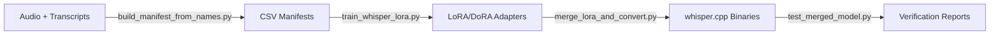

# Whisper.cpp Finetuning Supplement

This repository extends the [`whisper.cpp`](https://github.com/ggerganov/whisper.cpp) ecosystem with training-first tooling. It packages manifest helpers, LoRA/DoRA training wrappers, merge utilities, and validation scripts so you can deliver edge-ready Whisper checkpoints straight into `whisper.cpp` deployments.

## Why This Exists

- **Production-ready supplement:** Bridges the gap between Hugging Face fine-tuning workflows and the quantized runtimes in `whisper.cpp`.
- **Adapter-first design:** Focuses on lightweight LoRA/DoRA adapters so you can adapt Whisper models without touching upstream weights.
- **Deployment parity:** Includes conversion and verification helpers that ensure exported binaries mirror `whisper.cpp` expectations.

## Feature Highlights

- Automated CSV manifest generation for paired audio/transcript datasets.
- JSON-driven training runner with CLI overrides for rapid experimentation.
- Built-in support for LoRA, DoRA, and PiSSA initialization strategies.
- Merge and conversion script that drops merged weights directly into `whisper.cpp/models`.
- Sanity checks (`test_merged_model.py`, `verify_conversion_ready.py`) to validate decoded output before shipping.
- Configurable accelerators, gradient accumulation, and mixed precision baked in.

## Quick Start

1. **Install** dependencies: `pip install -r requirements.txt`.
2. **Prepare** manifests with `build_manifest_from_names.py`.
3. **Tune** Whisper checkpoints using `train_whisper_lora.py --config configs/train_whisper_lora.json`.
4. **Merge & Export** adapters via `merge_lora_and_convert.py`, pointing the output at your local `whisper.cpp` checkout.
5. **Validate** exports with `test_merged_model.py` and `verify_conversion_ready.py` before distributing models.

Detailed walkthroughs live in `docs/GETTING_STARTED.md`.

## Workflow Overview

## Documentation Map

- `docs/GETTING_STARTED.md` — Environment prep, training, and export walkthrough.
- `docs/WHISPER_CPP_CONVERSION_GUIDE.md` — Deep dive on export formats and quantization knobs.
- `docs/CHANGELOG.md` — Project history.
- `docs/CONTRIBUTING.md` — How to propose changes.
- `docs/CODE_OF_CONDUCT.md` — Community expectations.
- `docs/SECURITY.md` — Responsible disclosure process.

## Contributing

We love community patches! Read `docs/CONTRIBUTING.md` for branching, testing, and documentation expectations. All contributors agree to uphold the policies in `docs/CODE_OF_CONDUCT.md`.

## License

Distributed under the MIT License. See `LICENSE` for details.
